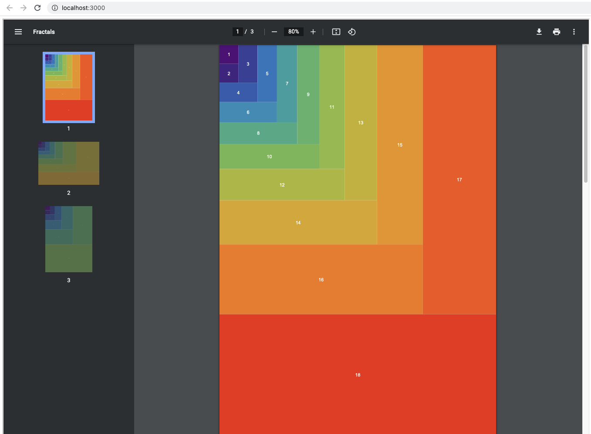
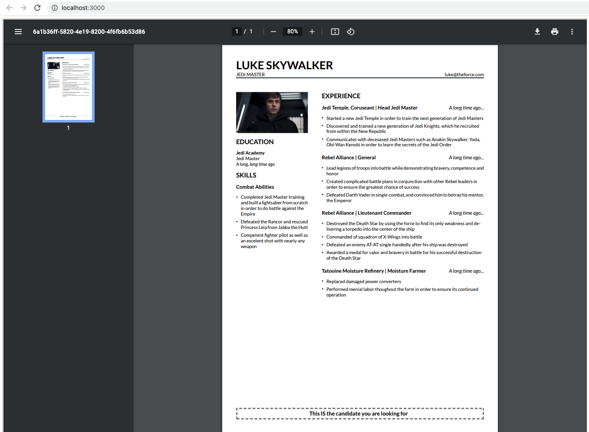
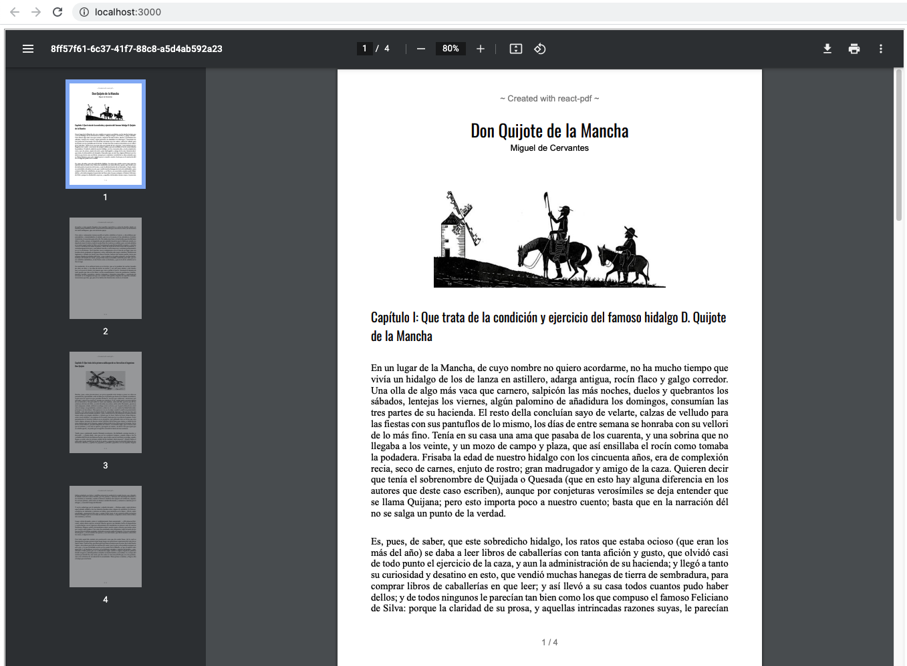

<p align="center">
  
  <p align="center">React renderer for creating PDF files on the browser and server<p>
  <p align="center">
    <a href="https://www.npmjs.com/package/@react-pdf/renderer">
      
    </a>
    <a href="https://travis-ci.org/diegomura/react-pdf">
      
    </a>
    <a href="https://github.com/diegomura/react-pdf/blob/master/LICENSE">
      
    </a>
    <a href="https://github.com/prettier/prettier">
      
    </a>
    <a href="https://app.fossa.com/projects/git%2Bgithub.com%2Fdiegomura%2Freact-pdf?ref=badge_shield" alt="FOSSA Status"></a>
  </p>
</p>

> New react-pdf 2.0 was released. [Read about the announcement](http://react-pdf.org/blog/announcing-react-pdf-v2)

## What can you create with react-pdf?
  <b>React-pdf</b> is a tool that allows you to render PDF documents through the use of <b>React Components</b>. Developers can create web pages that can be rendered as a downloadable document as well as display through the client’s web browser. A wide variety of use cases can be supported with this project; enabling dynamic web pages to be saved statically in a widely accepted document format. 
  <u>Simply add the tool as a dependency in your React project and display away!</u>

## How to install
```sh
yarn add @react-pdf/renderer
```

## How it works

```jsx
import React from 'react';
import { Document, Page, Text, View, StyleSheet } from '@react-pdf/renderer';

// Create styles
const styles = StyleSheet.create({
  page: {
    flexDirection: 'row',
    backgroundColor: '#E4E4E4'
  },
  section: {
    margin: 10,
    padding: 10,
    flexGrow: 1
  }
});

// Create Document Component
const MyDocument = () => (
  <Document>
    <Page size="A4" style={styles.page}>
      <View style={styles.section}>
        <Text>Section #1</Text>
      </View>
      <View style={styles.section}>
        <Text>Section #2</Text>
      </View>
    </Page>
  </Document>
);
```

### `Web.` Render in DOM
```jsx
import React from 'react';
import ReactDOM from 'react-dom';
import { PDFViewer } from '@react-pdf/renderer';

const App = () => (
  <PDFViewer>
    <MyDocument />
  </PDFViewer>
);

ReactDOM.render(<App />, document.getElementById('root'));
```

### `Node.` Save in a file
```jsx
import React from 'react';
import ReactPDF from '@react-pdf/renderer';

ReactPDF.render(<MyDocument />, `${__dirname}/example.pdf`);
```

## Examples

<div align="center">
  <h3>Render Abstract Images with Components</h3>
  <a href="./packages/templates/readme_images/fractal.png"></a>
  <br>
  Sample Link
  <a href =  "./packages/templates/readme_images/fractal.pdf">PDF Path</a>
</div>

<div align="center">
<h3>Create Your Professional Resume</h3>
<a href="./packages/templates/readme_images/resume.png"></a>
<br>
Sample Link
<a href =  "./packages/templates/readme_images/resume.pdf">PDF Path</a>
</div>

<div align="center">
<h3>Create Static Documents</h3>
<a href="./packages/templates/readme_images/document.png"></a>
<br>
Sample Link
<a href =  "./packages/templates/readme_images/document.pdf">PDF Path</a>
</div>

<br>

## To check the source code and run the examples locally:
(Done via your OS terminal)
<br><b>1.</b> Clone this repository with your terminal: <b>git clone https://github.com/diegomura/react-pdf</b>
<br><b>2.</b> Navigate to sub-directory <b>"/react-pdf/templates/"</b>
<br><b>3.</b> Navigate to folder: <b>Fractal, Resume or Document.</b>
<br><b>4.</b> In the folder of the template to view, enter command in the terminal: <b>npm install --legacy-peer-deps</b>
<br><b>5.</b> After all dependencies are installed, type in terminal to run: <b>npm start</b>
<br><b>6.</b> Sample pages will be viewable through the browser @ <b>http://localhost:3000/</b>
<br>


## Contributors

This project exists thanks to all the people who contribute. [[Contribute]](CONTRIBUTING.md).
<a href="https://github.com/diegomura/react-pdf/graphs/contributors"></a>

## Sponsors

Thank you to all our sponsors! [[Become a sponsors](https://opencollective.com/react-pdf#sponsors)]

<a href="https://opencollective.com/react-pdf#sponsors" target="_blank"></a>

## Backers

Thank you to all our backers! [[Become a backer](https://opencollective.com/react-pdf#backer)]

<a href="https://opencollective.com/react-pdf#backers" target="_blank"></a>

## License

MIT © [Diego Muracciole](http://github.com/diegomura)

[](https://app.fossa.com/projects/git%2Bgithub.com%2Fdiegomura%2Freact-pdf?ref=badge_large)

---

